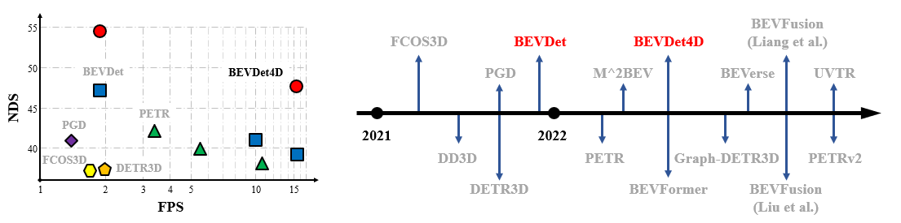

### Architecture


### Abstract
Single frame data contains finite information which limits the performance of the existing vision-based multi-camera 3D object detection paradigms. For fundamentally pushing the performance boundary in this area, a novel paradigm dubbed BEVDet4D is proposed to lift the scalable BEVDet paradigm from the spatial-only 3D space to the spatial-temporal 4D space. We upgrade the naive BEVDet framework with a few modifications just for fusing the feature from the previous frame with the corresponding one in the current frame. In this way, with negligible additional computing budget, we enable BEVDet4D to access the temporal cues by querying and comparing the two candidate features. Beyond this, we simplify the task of velocity prediction by removing the factors of ego-motion and time in the learning target. As a result, BEVDet4D with robust generalization performance reduces the velocity error by up to -62.9%. This makes the vision-based methods, for the first time, become comparable with those relied on LiDAR or radar in this aspect. On challenge benchmark nuScenes, we report a new record of 54.5% NDS with the high-performance configuration dubbed BEVDet4D-Base, which surpasses the previous leading method BEVDet-Base by +7.3% NDS. 

### Performance and  Literature




### Code
Access code here in [GitHub](https://github.com/HuangJunJie2017/BEVDet).

### Paper
Download paper here in [Arxiv](https://arxiv.org/pdf/2203.17054.pdf).

### Cite
```
@article{huang2022bevdet4d,
    title={BEVDet4D: Exploit Temporal Cues in Multi-camera 3D Object Detection},
    author={Huang, Junjie and Huang, Guan},
    journal={arXiv preprint arXiv:2203.17054},
    year={2022}
}
```
